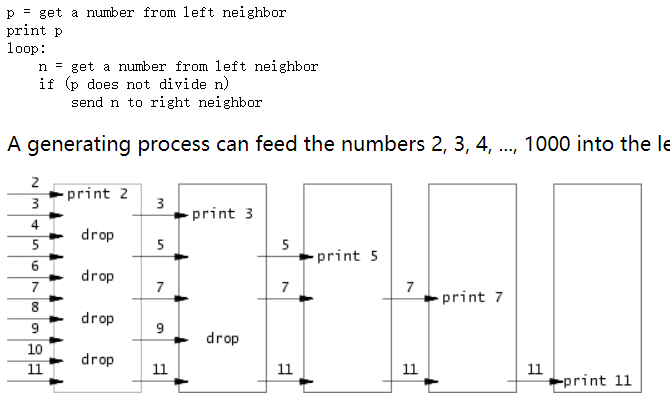

## sleep(Easy)

这段xv6内核代码是一个简化版的 `sleep` 系统调用实现,通过不断检查时钟滴答数的变化，直到达到指定的睡眠时间为止。在等待期间，如果进程被标记为 `killed`，则立即退出睡眠循环。

```c
sys_sleep(void)
{
  int n;
  uint ticks0;//声明了两个变量 `n` 和 `ticks0`，`n` 是以时钟滴答数为单位的睡眠时间。

  if(argint(0, &n) < 0)
    return -1;//使用 `argint` 函数从用户态获取系统调用参数，参数索引为 0，将得到的整数值存储在 `n` 变量中。如果获取参数失败，则返回 -1。
  acquire(&tickslock);
  ticks0 = ticks;
  //使用自旋锁 `tickslock`，保证对全局变量 `ticks` 的访问的互斥性。将当前时钟滴答数保存在变量 `ticks0` 中作为起始时间。
  while(ticks - ticks0 < n){
    if(myproc()->killed){
      release(&tickslock);
      return -1;
    }
    sleep(&ticks, &tickslock);
  }//进入一个循环，直到当前时钟滴答数与起始时间之差达到要求的睡眠时间 `n`。在每次迭代中，检查当前进程是否被标记为 `killed`，如果是则退出循环并释放自旋锁。如果进程未被杀死，则调用 `sleep` 函数使当前进程进入睡眠状态，并释放自旋锁。
  release(&tickslock);
  return 0;
}
```

sleep.c的实现如下：

```c
#include "kernel/types.h"
#include "kernel/stat.h"
#include "user/user.h"

int main(int argc, char *argv[])
{
    if (argc != 2)
    {
        fprintf(2, "arg error\n");
        exit(1);
    }

    int n = atoi(argv[1]);
    if(sleep(n) < 0){
        exit(1);
    }
    exit(0);
}

```

---

## pingpong(Easy)

使用 UNIX 系统调用编写一个程序 pingpong ，在一对管道上实现两个进程之间的通信。父进程应该通过第一个管道给子进程发送一个信息 “ping”，子进程接收父进程的信息后打印 `"<pid>: received ping"` ，其中是其进程 ID 。然后子进程通过另一个管道发送一个信息 “pong” 给父进程，父进程接收子进程的信息然后打印 `"<pid>: received pong"` ，然后退出。

```c
#include "kernel/types.h"
#include "kernel/stat.h"
#include "user/user.h"

int main(int argc, char *argv[])
{
    int ptoc[2], ctop[2];
    char buf[8];
    pipe(ptoc);
    pipe(ctop);

    if (fork() == 0)
    {
        read(ptoc[0], buf, 4);
        printf("%d: received %s\n", getpid(), buf);
        write(ctop[1], "pong", strlen("pong"));
    }
    else
    {
        write(ptoc[1], "ping", strlen("ping"));
        //调用 wait() 函数等待子进程完成操作后退出，传入参数0或者NULL，不过后者需要引入头文件 stddef.h
        wait(0);
        read(ctop[0], buf, 4);
        printf("%d: received %s\n", getpid(), buf);
    }
    exit(0);
}
```

---

## primes(Moderate/Hard)

使用管道将 `2` 至 `35` 中的素数筛选出来，你的目标是使用 `pipe` 和 `fork` 来创建管道。第一个进程将数字 `2` 到 `35` 送入管道中。对于每个质数，你要安排创建一个进程，从其左邻通过管道读取，并在另一条管道上写给右邻。由于 xv6 的文件描述符和进程数量有限，第一个进程可以停止在 `35` 。

A generating process can feed the numbers 2, 3, 4, ..., 1000 into the left end of the pipeline: the first process in the line eliminates the multiples of 2, the second eliminates the multiples of 3, the third eliminates the multiples of 5, and so on:



```c
#include "kernel/types.h"
#include "kernel/stat.h"
#include "user/user.h"

void primes(int pipe_read)
{
    int first;
    //递归输出第一个num；直到pipe为空
    if (read(pipe_read, &first, sizeof(int)) != 0)
    {
        printf("prime %d\n", first);
    }
    else
    {
        close(pipe_read);
        exit(0);
    }

    int p[2];
    pipe(p);
    int num;
    if (fork() == 0)
    {
        while (read(pipe_read, &num, sizeof(int)) != 0)
        {
            if (num % first != 0)//将不能整除第一个num的输出到下一个pipe
            {
                write(p[1], &num, sizeof(int));
            }
        }
        //一定要关闭不需要的文件描述符，节省系统资源
        close(pipe_read);
        close(p[1]);
        primes(p[0]);
    }
    else
    {
        close(p[0]);
        close(p[1]);
        wait(0);
    }
    exit(0);
}

int main()
{
    int p[2];
    pipe(p);
    int nums[34];

    for (int i = 0; i < 34; i++)
    {
        nums[i] = i + 2;
        write(p[1], &nums[i], sizeof(int));
    }
    close(p[1]);
    primes(p[0]);
    exit(0);
}
```

---

## find(Moderate)

编写一个简单的 UNIX `find` 程序，在目录树中查找包含特定名称的所有文件。

整体结构可参照`ls.c`

```c
#include "kernel/types.h"
#include "kernel/stat.h"
#include "user/user.h"
#include "kernel/fs.h"

void find(char *path, char *file)
{
    char buf[512], *p;
    int fd;
    struct dirent de;
    struct stat st;

    if ((fd = open(path, 0)) < 0)
    {
        fprintf(2, "find: cannot open %s\n", path);
        return;
    }

    if (fstat(fd, &st) < 0)
    {
        fprintf(2, "find: cannot stat %s\n", path);
        close(fd);
        return;
    }

    if (strlen(path) + 1 + DIRSIZ + 1 > sizeof buf)
    {
        printf("find: path too long\n");
    }

    strcpy(buf, path);
    p = buf + strlen(buf);
    *p++ = '/';

    if (st.type != T_DIR)
    {
        fprintf(2, "find: %s is not a directory\n", path);
        // 关闭文件描述符 fd
        close(fd);
        return;
    }

    while (read(fd, &de, sizeof(de)) == sizeof(de))
    {
        if (de.inum == 0)
            continue;
        if (!strcmp(de.name, ".") || !strcmp(de.name, ".."))
            continue;
        memmove(p, de.name, DIRSIZ);
        p[DIRSIZ] = 0;
        if (stat(buf, &st) < 0)
        {
            printf("find: cannot stat %s\n", buf);
            continue;
        }

        //如果类型为文件且名称与要查找的文件名相同则输出路径，如果是目录类型则递归调用 find() 函数继续查找。
        if (st.type == T_DIR)
        {
            find(buf, file);
        }
        else if (st.type == T_FILE && !strcmp(de.name, file))
        {
            printf("%s\n", buf);
        }
    }
}

int main(int argc, char *argv[])
{
    if (argc < 3)
    {
        fprintf(2, "Please provide at least 3 parameters.\n");
        exit(1);
    }
    for (int i = 2; i < argc; i++)
    {
        find(argv[1], argv[i]);
    }
    exit(0);
}
```


---

## xargs(Moderate)

编写一个简单的 UNIX `xargs` 程序，从标准输入中读取行并为每一行运行一个命令，将该行作为命令的参数提供。

> $ echo hello too | xargs echo bye 
>
> bye hello too

其实就是拼接字符串， 然后使用`fork()`和`exec()`。但是有个bug没搞清。

```c
#include "kernel/types.h"
#include "kernel/stat.h"
#include "kernel/param.h"
#include "user/user.h"

int main(int argc, char *argv[])
{
    if (argc < 2)
    {
        fprintf(2, "Please provide at least 2 parameters.\n");
        exit(1);
    }

    char *argvs[MAXARG];
    int index = 0;
    for (int i = 1; i < argc; i++)
    {
        argvs[index] = argv[i];
        index += 1;
    }

    // 缓冲区存放从管道读出的数据
    char buf[512] = {"\0"};
    char temp[512] = {"\0"};

    int n;
    if ((n = read(0, buf, 512)) == -1)
    {
        fprintf(2, "xargs: read error");
    }

    int j = 0;
    for (int i = 0; i < strlen(buf); ++i)
    {
        if (buf[i] == '\n')
        {
            argvs[index] = temp;
            //temp之前已经初始化了 但是不加这个会报错 没搞清楚是为什么
            temp[j] = '\0';
            if (fork() == 0)
            {
                exec(argv[1], argvs);
                exit(1);
            }
            else
            {
                wait(0);
                index = argc - 1;
                j = 0;
            }
        }
        else
        {
            temp[j++] = buf[i];
        }
    }

    exit(0);
}
```

